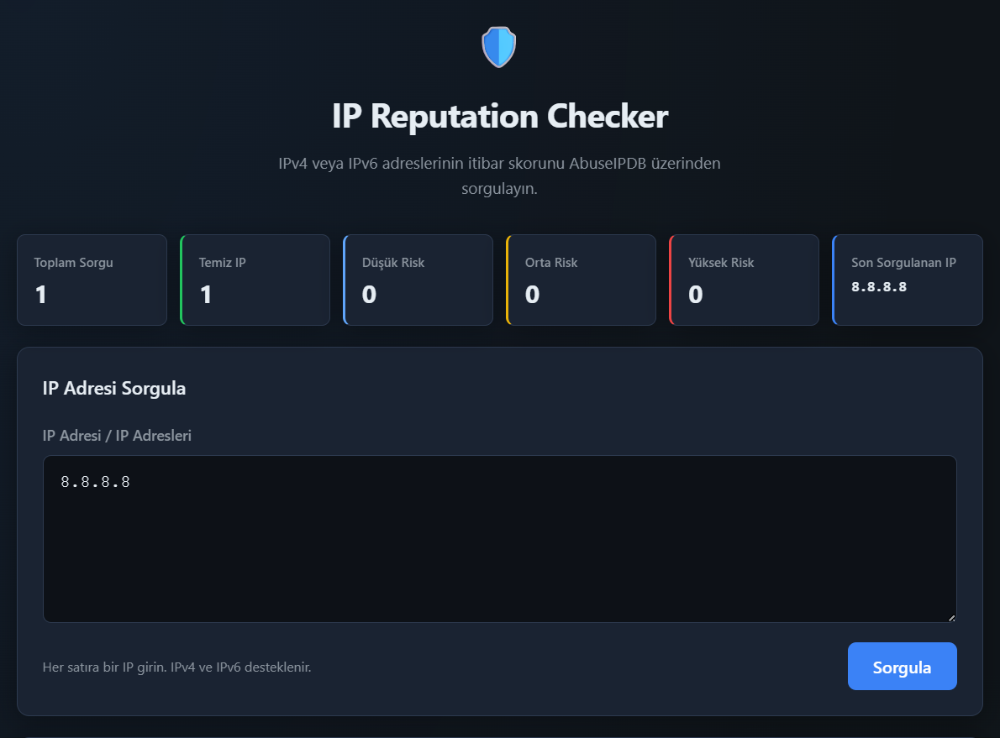
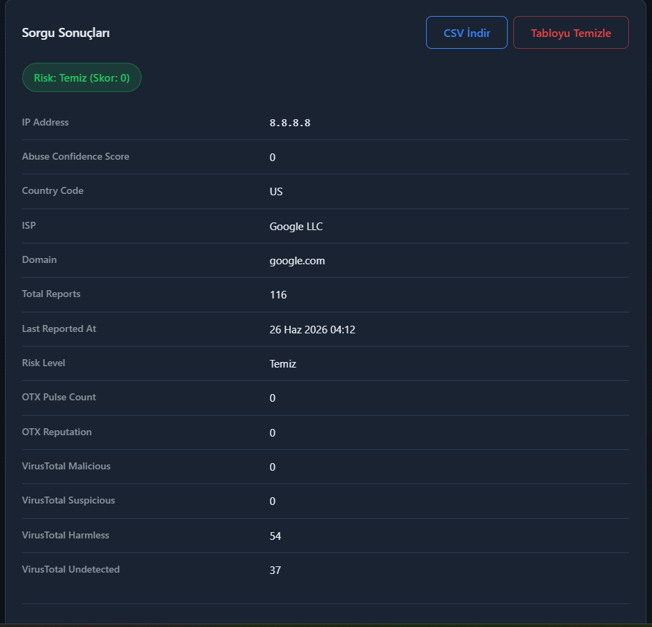
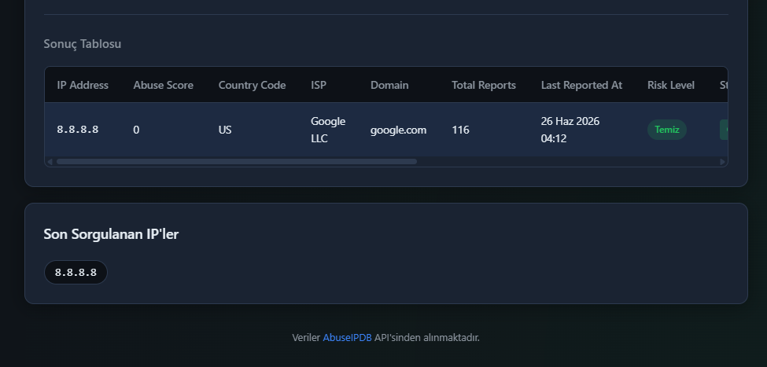

# IP Reputation Checker

IPv4 ve IPv6 adreslerinin itibar skorunu sorgulayan full stack web uygulaması. Tek veya çoklu IP adresi girilebilir; backend AbuseIPDB, AlienVault OTX ve VirusTotal API'lerine istek atar, sonuçlar modern bir arayüzde gösterilir.





## Proje Ne Yapıyor?

- Kullanıcının girdiği tek veya birden fazla IP adresini doğrular (IPv4 / IPv6)
- Backend üzerinden AbuseIPDB, AlienVault OTX ve VirusTotal API'lerine güvenli sorgu gönderir
- IP'nin abuse skoru, ülke kodu, ISP, domain, rapor sayısı ve risk seviyesini gösterir
- OTX pulse sayısı, reputation ve VirusTotal motor analiz sonuçlarını opsiyonel olarak gösterir
- Çoklu sorgularda her IP ayrı ayrı işlenir; bir IP başarısız olsa diğerleri devam eder
- Son sorgulanan IP'leri tarayıcı LocalStorage'ında saklar
- Dashboard ile sorgu istatistiklerini özetler
- Sorgu sonuçlarını CSV olarak indirmeyi destekler (tek veya çoklu IP)
- Sonuç tablosunu "Tabloyu Temizle" butonu ile sıfırlamayı destekler

---


## Hangi API'ler Kullanılıyor?


### AbuseIPDB (Zorunlu)

[AbuseIPDB API v2](https://docs.abuseipdb.com/) — `GET https://api.abuseipdb.com/api/v2/check`

Backend, API anahtarını HTTP `Key` header'ı ile gönderir. Anahtar yalnızca sunucu tarafında tutulur; frontend doğrudan AbuseIPDB'ye istek atmaz.

### AlienVault OTX (Opsiyonel)

[AlienVault OTX API v1](https://otx.alienvault.com/api) — `GET https://otx.alienvault.com/api/v1/indicators/IPv4/{ip}/general`

- `OTX_API_KEY` tanımlıysa her sorguda OTX'ten ek tehdit bilgisi çekilir
- Tanımlı değilse uygulama sorunsuz çalışır; OTX sütunları "Yapılandırılmadı" olarak gösterilir
- OTX'ten hata gelse bile AbuseIPDB sonucu etkilenmez

OTX'ten alınan bilgiler:


| Alan            | Açıklama                                              |
| --------------- | ----------------------------------------------------- |
| OTX Pulse Count | IP'nin kaç tehdit istihbarat kaydında geçtiği         |
| OTX Reputation  | OTX reputation skoru (0 = temiz, yükseldikçe şüpheli) |


### VirusTotal (Opsiyonel)

[VirusTotal API v3](https://developers.virustotal.com/reference/ip-info) — `GET https://www.virustotal.com/api/v3/ip_addresses/{ip}`

- `VT_API_KEY` tanımlıysa her sorguda 70+ antivirüs motorunun analiz sonuçları çekilir
- Tanımlı değilse uygulama sorunsuz çalışır; VT sütunları "Yapılandırılmadı" veya "—" olarak gösterilir
- VT'den hata gelse bile AbuseIPDB sonucu etkilenmez

VT'den alınan bilgiler:


| Alan          | Açıklama                                   |
| ------------- | ------------------------------------------ |
| VT Malicious  | IP'yi zararlı bulan motor sayısı           |
| VT Suspicious | IP'yi şüpheli bulan motor sayısı           |
| VT Harmless   | IP'yi temiz bulan motor sayısı             |
| VT Undetected | IP hakkında sonuç bildirmeyen motor sayısı |


---


## Nasıl Çalıştırılır?


### Gereksinimler

- [Node.js](https://nodejs.org/) v18 veya üzeri
- **AbuseIPDB API anahtarı** (zorunlu) — [abuseipdb.com/account/api](https://www.abuseipdb.com/account/api) adresinden ücretsiz alınabilir
- AlienVault OTX API anahtarı (opsiyonel) — [otx.alienvault.com/api](https://otx.alienvault.com/api)
- VirusTotal API anahtarı (opsiyonel) — [virustotal.com/gui/my-apikey](https://www.virustotal.com/gui/my-apikey)

---


### Adım 1 — Projeyi İndirin

**Git ile klonlama (önerilen):**

```bash
git clone https://github.com/m-onursolmaz/ip-reputation-checker.git
cd ip-reputation-checker
```

**ZIP olarak indirme:**

GitHub'da yeşil **Code** butonuna tıklayın → **Download ZIP** seçin. İndirilen `.zip` dosyasına sağ tıklayıp **Tümünü Ayıkla / Extract All** seçeneğiyle klasörü çıkarın. Klasör çıkarıldıktan sonra backend klasöründe terminal açarak aşağıdaki adımları uygulayın.

Projeyi VS Code, WebStorm veya istediğiniz herhangi bir kod editörüyle açabilirsiniz. Kod editörü zorunlu değildir; yalnızca terminal (PowerShell, CMD veya bash) ile de çalıştırabilirsiniz.

---


### Adım 2 — Bağımlılıkları Yükleyin

Backend klasörüne geçin ve gerekli Node.js paketlerini yükleyin:

```powershell
cd backend
npm install
```

`npm install` komutu, projenin çalışması için gereken tüm Node.js bağımlılıklarını `node_modules` klasörüne indirir.

---


### Adım 3 — API Anahtarlarını Ayarlayın

`.env.example` dosyasından `.env` dosyası oluşturun:

```powershell
Copy-Item .env.example .env
```

İsterseniz manuel olarak `backend` klasörü içinde `.env` adında yeni bir dosya da oluşturabilirsiniz.

`.env` dosyası, API anahtarlarınızı ve sunucu ayarlarını güvenli şekilde saklar. ABUSEIPDB_API_KEY girilmezse IP sorgulaması çalışmaz.

Oluşturulan `.env` dosyasını bir metin editörüyle açıp değerleri doldurun:

```
ABUSEIPDB_API_KEY=your_abuseipdb_key
OTX_API_KEY=your_otx_key
VT_API_KEY=your_virustotal_key
PORT=3000
```

**API anahtarları hakkında:**


| Değişken            | Durum       | Açıklama                                           |
| ------------------- | ----------- | -------------------------------------------------- |
| `ABUSEIPDB_API_KEY` | **Zorunlu** | Boş bırakılırsa IP sorgulaması çalışmaz            |
| `OTX_API_KEY`       | Opsiyonel   | Boş bırakılabilir; OTX verileri gösterilmez        |
| `VT_API_KEY`        | Opsiyonel   | Boş bırakılabilir; VirusTotal verileri gösterilmez |
| `PORT`              | Opsiyonel   | Varsayılan: `3000`                                 |


> OTX veya VirusTotal anahtarı girilmezse uygulama çalışmaya devam eder; yalnızca ilgili sütunlar "Yapılandırılmadı" olarak görünür.

---


### Adım 4 — Backend'i Başlatın

```powershell
npm start
```

Geliştirme sırasında dosya değişikliklerinde otomatik yeniden başlatma için:

```powershell
npm run dev
```

Backend başarıyla çalıştığında terminalde şu çıktıyı görürsünüz:

```
IP Reputation Checker çalışıyor: http://localhost:3000
API endpoint: POST http://localhost:3000/check
```

---


### Adım 5 — Uygulamayı Açın

Express, frontend dosyalarını backend ile aynı port üzerinden sunar. Tarayıcınızda şu adresi açın:

```
http://localhost:3000
```

Ayrı bir frontend sunucusu gerekmez. Uygulama kullanıma hazırdır.

---


## API Key Güvenliği

Tüm API anahtarları yalnızca backend'deki `.env` dosyasında saklanır:

- Tarayıcıya veya frontend koduna hiçbir anahtar gönderilmez
- Frontend yalnızca `fetch('/check')` ile kendi backend'ine istek atar
- `.env` dosyası `.gitignore` içinde yer alır ve versiyonlanmamalıdır
- Paylaşım için `.env.example` şablonu kullanılır

---


## Risk Seviyeleri

AbuseIPDB'den dönen **Abuse Confidence Score** (0–100) değerine göre:


| Skor   | Risk Seviyesi |
| ------ | ------------- |
| 0      | Temiz         |
| 1–25   | Düşük Risk    |
| 26–75  | Orta Risk     |
| 76–100 | Yüksek Risk   |


Hesaplama `backend/utils/riskLevel.js` dosyasında yapılır ve sonuç frontend'e `riskLevel` objesi olarak iletilir.

---


## Özellikler


### Çoklu IP Sorgulama

- Textarea'ya her satıra bir IP yazarak toplu sorgu yapılabilir
- Tek IP girilirse detay kart gösterilir; birden fazla girilirse özet badge ve toplu tablo gösterilir
- Boş satırlar ve tekrar eden IP'ler otomatik yoksayılır
- Bir IP hata verse diğerleri sorgulanmaya devam eder; hatalı IP'ler tabloda kırmızı satırla gösterilir


### Sonuç Tablosu

- Tüm sorgu sonuçları; IP, AbuseIPDB, OTX ve VirusTotal verileriyle birlikte listelenir
- Tablo sabit yükseklikte, dikey kaydırılabilir; başlık satırı üstte sabit kalır
- "Tabloyu Temizle" butonu tabloyu ve LocalStorage kayıtlarını sıfırlar; Dashboard güncellenir


### CSV Export

- Sorgu sonrası "CSV İndir" butonu aktif olur
- Tek IP sorgusunda tek satır, çoklu sorguda tüm sonuçlar (başarılı + hatalı) CSV'ye eklenir
- Sütunlar: IP Address, Abuse Score, Country Code, ISP, Domain, Total Reports, Last Reported At, Risk Level, Status, OTX Pulse Count, OTX Reputation, VT Malicious, VT Suspicious, VT Harmless, VT Undetected
- UTF-8 BOM ile Excel uyumluluğu sağlanır


### Dashboard

Sayfanın üst kısmında istatistik kartları:

- Toplam sorgu sayısı
- Temiz / Düşük / Orta / Yüksek risk dağılımı
- En son sorgulanan IP

Veriler LocalStorage'dan hesaplanır; sayfa yenilendiğinde korunur.

---


## Proje Yapısı

```
ip-reputation-checker/
├── backend/
│   ├── server.js                  # Express sunucusu
│   ├── routes/
│   │   └── check.js               # POST /check endpoint
│   ├── services/
│   │   ├── abuseIpDb.js           # AbuseIPDB entegrasyonu
│   │   ├── otx.js                 # AlienVault OTX entegrasyonu
│   │   └── virustotal.js          # VirusTotal entegrasyonu
│   ├── utils/
│   │   ├── ipValidator.js         # IP doğrulama
│   │   └── riskLevel.js           # Risk seviyesi hesaplama
│   ├── .env.example               # Ortam değişkenleri şablonu
│   └── package.json
├── frontend/
│   ├── index.html
│   ├── css/
│   │   └── styles.css
│   └── js/
│       ├── app.js                 # Ana uygulama mantığı
│       ├── api.js                 # Backend iletişim katmanı
│       └── history.js             # LocalStorage yönetimi
└── README.md
```

---


## API Endpoint

```
POST /check
Content-Type: application/json

{ "ip": "8.8.8.8" }
```

Başarılı yanıt örneği:

```json
{
  "success": true,
  "data": {
    "ipAddress": "8.8.8.8",
    "abuseConfidenceScore": 0,
    "countryCode": "US",
    "isp": "Google LLC",
    "domain": "google.com",
    "totalReports": 0,
    "lastReportedAt": null,
    "riskLevel": { "level": "clean", "label": "Temiz" },
    "otx": { "available": true, "pulseCount": 0, "reputation": 0 },
    "virustotal": { "available": true, "malicious": 0, "suspicious": 0, "harmless": 80, "undetected": 10 }
  }
}
```

---

## Diğer Görünümler

### Sorgu Sonucu



### Sonuç Tablosu

